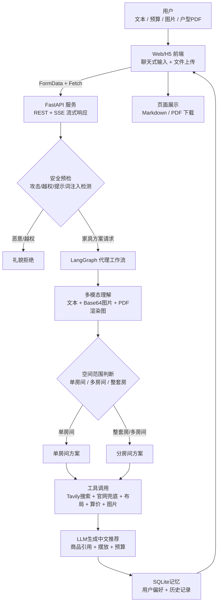
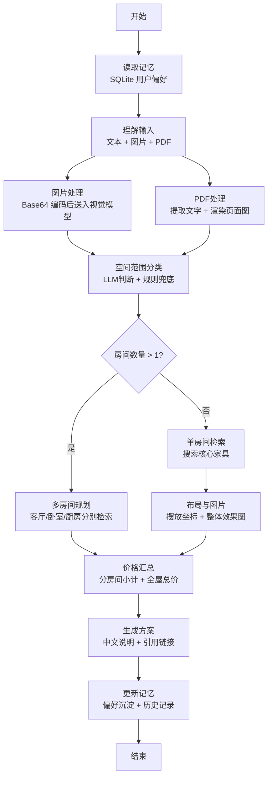
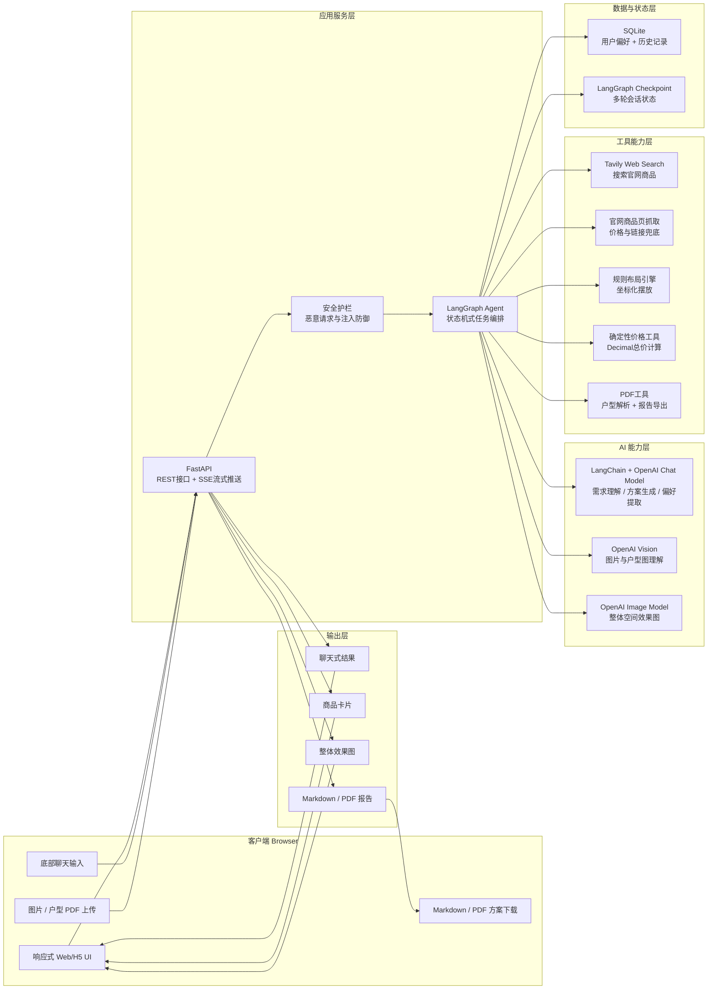
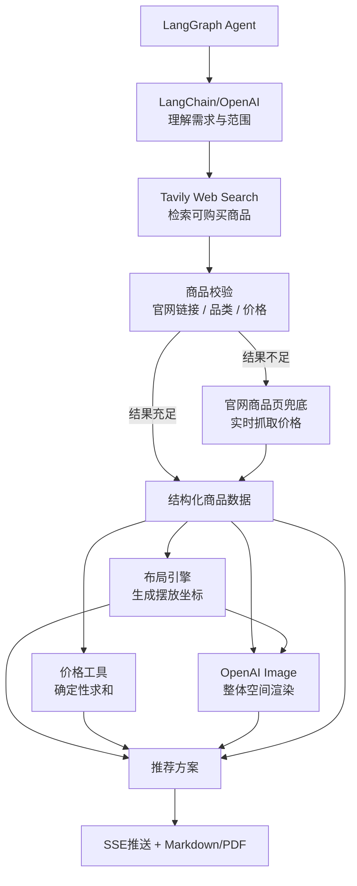
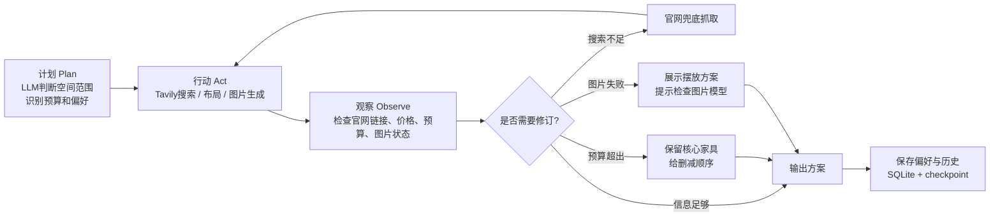

# 家具选择助手课题分析：代理式工作流、工具调用与多模态组件

本文基于当前代码仓库分析家具选择助手的代理式工作流、工具使用方式和多模态能力。系统采用 FastAPI 提供 C/S 接口，使用 LangGraph 编排代理节点，使用 LangChain/OpenAI 完成语言理解、视觉理解和方案生成，并通过搜索、布局、价格计算、图片生成、PDF 导出等函数形成完整推荐链路。

## 4. 代理式工作流说明

本系统的代理流程可以理解为：用户提出空间需求后，前端通过 C/S 模式把文本、预算、图片或 PDF 发送到 FastAPI；后端用 LangGraph 编排代理步骤，用 LangChain/OpenAI 处理语言和视觉理解，用 Tavily 搜索官网商品，用确定性函数计算价格，并通过 SSE 流式推送给前端。相比普通聊天机器人，它不是一次性生成答案，而是将任务拆成多个可观察、可修订的步骤。

### 4.1 工作流总览图



### 4.2 LangGraph 代理节点图

代理内部使用 LangGraph 的状态图模式。每个节点负责一个阶段，节点之间共享 `FurnitureState`，因此系统能把搜索结果、图片理解、价格、摆放和用户偏好串起来。



### 4.3 系统架构图

系统整体采用 C/S 架构。浏览器负责交互和可视化，FastAPI 负责 API 与流式传输，LangGraph 负责代理编排，LangChain/OpenAI 负责大模型能力，Tavily 负责外部搜索，SQLite 和 LangGraph checkpoint 负责记忆与会话状态。



### 4.4 工具协作图



### 4.5 计划 -> 行动 -> 观察 -> 修订循环图



简化来看，代理的循环是：先判断用户到底要哪个空间，再调用搜索、布局、价格、图片等工具；如果观察到搜索结果不足、没有价格或预算不合适，就修订策略，例如启用官网兜底或给出预算删减建议。

### 4.6 技术组件说明

| 技术组件 | 面向客户的解释 | 在系统中的价值 |
|---|---|---|
| FastAPI | 后端 API 框架，负责接收用户请求和返回结果。 | 支持普通请求和 SSE 流式推送，让用户能边生成边看到进度。 |
| LangGraph | 代理工作流编排框架，把任务拆成多个节点。 | 让系统有“步骤”和“状态”，而不是一次性回答。 |
| LangChain + OpenAI Chat Model | 大模型调用层，用于需求理解、范围判断、方案生成和偏好提取。 | 提供自然语言理解与生成能力。 |
| OpenAI Vision | 多模态视觉理解，用于分析用户上传的空间图片或户型 PDF 渲染图。 | 把图片线索转成可用于推荐的空间约束。 |
| Base64 图片传输 | 图片上传后被转成 Base64，再传给视觉模型或图片模型。 | 统一处理图片/PDF 渲染图，便于模型读取。 |
| Tavily Web Search | 外部搜索服务，用于搜索带官网链接和价格的商品。 | 降低模型编造商品的风险。 |
| 官网商品页兜底抓取 | 当搜索结果不足时，直接访问官网商品页读取价格。 | 避免服务器搜索不稳定导致方案为空。 |
| OpenAI Image Model | 根据商品和摆放坐标生成整体空间效果图。 | 将文字方案转成视觉效果，帮助用户理解搭配。 |
| SQLite | 本地轻量数据库。 | 保存用户 uid、偏好和历史记录，实现记忆能力。 |
| Markdown/PDF 输出 | 报告导出格式。 | 方便用户保存、提交、分享方案。 |

## 5. 工具使用或函数调用演示

### 5.1 工具调用总览

| 工具/函数名称 | 代码位置 | 工具用途 | 输入 | 输出 | 助手如何使用结果 |
|---|---|---|---|---|---|
| `preflight_request()` | `app/guardrails.py` | 安全预检，阻止密钥、攻击、越权、提示词注入等请求 | `request`、`has_upload` | `PreflightResult` | 若 `should_stop` 为真，FastAPI 直接返回拒绝消息，不进入代理工作流。 |
| `_get_llm()` | `app/agent.py` | 创建 ChatOpenAI 客户端 | 环境变量 `OPENAI_API_KEY`、`OPENAI_MODEL` | LLM 对象或 `None` | 用于图片理解、房间范围分类、推荐文本和偏好提取；无 key 时走规则兜底。 |
| `analyze_pdf_bytes()` | `app/pdf_utils.py` | 解析户型 PDF，提取文本并渲染页面图片 | PDF bytes | `PdfContext` | `understand_image()` 将文本和页面图片交给视觉模型，生成空间线索。 |
| `search_furniture()` | `app/search.py` | 搜索可购买商品并校验价格 | 查询文本、预算、用户偏好 | `list[FurnitureItem]` | 代理只允许推荐这些带价格和引用链接的商品，避免编造。 |
| `_search_with_tavily()` | `app/search.py` | 通过 Tavily 执行 web search | Tavily key、查询、房间类型 | 候选商品 | 搜索官网商品页，返回后继续校验 URL、类别和价格。 |
| `_search_official_fallback()` | `app/search.py` | 搜索失败或结果太少时的官网兜底 | 商品品类列表 | 候选商品 | 保证服务器无 Tavily 或搜索波动时仍能返回带官网链接和价格的商品。 |
| `plan_furniture_layout()` | `app/layout.py` | 生成家具摆放坐标和说明 | 商品列表、用户请求 | `list[FurniturePlacement]` | 前端用坐标和说明展示摆放方案；图片生成也把坐标传入 prompt。 |
| `generate_room_image()` | `app/images.py` | 生成整体房间效果图 | 商品、摆放、请求、图片线索 | 图片 URL 或 base64 data URL | 前端 `renderRoom()`/`renderRoomPlans()` 展示真实整体效果图。 |
| `calculate_cart_total()` | `app/tools.py` | 后端确定性计算总金额 | 商品列表 | `pricing` 字典 | 推荐文本必须使用这里的 `total`，避免 LLM 心算错误。 |
| `build_plan_pdf()` | `app/pdf_export.py` | 将方案转成 PDF | `RecommendationResponse` | PDF bytes | `/api/plan/pdf` 返回下载文件。 |
| `get_preferences()`/`update_preferences()`/`add_history()` | `app/storage.py` | 用户偏好和历史记忆 | `uid`、偏好、摘要 | SQLite 记录 | 下次请求读取偏好，实现基于 uid 的长期记忆。 |

### 5.2 函数调用演示一：商品搜索工具

**工具名称：** `search_furniture()`

**代码位置：** `app/search.py`

**用途：** 根据用户需求和偏好搜索官网商品，保证每个商品都有名称、品类、价格、币种、链接和来源说明。

**输入示例：**

```python
await search_furniture(
    query="设计一个20平卧室，温馨木色，预算8000",
    budget=8000,
    preferences={"style": "温馨", "color": "木色"},
)
```

**内部逻辑：**

1. `_infer_room()` 判断房间类型，如卧室对应 `bedroom`。
2. `ROOM_CATEGORY_PLAN` 将卧室映射为 `bed`、`nightstand`、`lamp`、`rug`、`wardrobe`、`storage`。
3. 如果配置 `TAVILY_API_KEY`，调用 `_search_with_tavily()`。
4. 搜索结果经过 `_is_allowed_product_url()`、`_is_noisy_result()`、`_matches_category()` 过滤。
5. `_fetch_product_price()` 从商品页读取价格。
6. 如果搜索结果太少，调用 `_search_official_fallback()` 从固定官网商品页兜底。
7. `_fit_budget()` 按预算筛选商品。

**输出示例结构：**

```json
[
  {
    "name": "MALM 马尔姆 高床架 白色/鲁瑞",
    "category": "bed",
    "price": 1499.0,
    "currency": "CNY",
    "url": "https://www.ikea.cn/cn/zh/p/...",
    "reason": "来自官网商品页；已读取到商品价格。购买前请核验实时价格、库存、尺寸、配送和安装条件。"
  }
]
```

**助手如何使用工具结果：** `generate_recommendation()` 将这些商品序列化进 `RECOMMENDATION_PROMPT`，要求 LLM 只能推荐候选列表内的商品，并必须保留引用链接。

### 5.3 函数调用演示二：价格计算工具

**工具名称：** `calculate_cart_total()`

**代码位置：** `app/tools.py`

**用途：** 统一计算总金额，避免大模型估算错误。

**输入示例：**

```python
calculate_cart_total(items=[
    FurnitureItem(name="床架", category="bed", price=1499, currency="CNY"),
    FurnitureItem(name="落地灯", category="lamp", price=79.99, currency="CNY"),
])
```

**输出示例：**

```json
{
  "currency": "CNY",
  "subtotal": 1578.99,
  "total": 1578.99,
  "line_items": [
    {"name": "床架", "category": "bed", "price": 1499.0, "currency": "CNY"},
    {"name": "落地灯", "category": "lamp", "price": 79.99, "currency": "CNY"}
  ],
  "unknown_price_items": [],
  "calculation_note": "总金额由后端 pricing tool 使用候选商品价格逐项相加；不含税费、配送、安装和实时折扣。"
}
```

**助手如何使用工具结果：** `generate_recommendation()` 将 `pricing.total` 传入提示词，并明确“总金额必须使用后端价格计算工具结果，不要自行心算或改写数值”。

### 5.4 函数调用演示三：布局工具

**工具名称：** `plan_furniture_layout()`

**代码位置：** `app/layout.py`

**用途：** 按房间类型给家具分配摆放区域、归一化坐标和解释。

**输入：**

```python
plan_furniture_layout(items, request="20平卧室，4x5，温馨木色")
```

**输出：**

```json
[
  {
    "item_name": "MALM 马尔姆 高床架",
    "category": "bed",
    "zone": "north wall",
    "x": 0.22,
    "y": 0.34,
    "width": 0.50,
    "height": 0.34,
    "note": "床头靠主墙，左右保留走道。"
  }
]
```

**助手如何使用工具结果：** 前端 `renderRoom()` 展示 `zone` 和 `note`；图片生成函数 `_room_image_prompt()` 把坐标和说明写入图像提示词，使生成图按布局摆放家具。

### 5.5 函数调用演示四：图片生成工具

**工具名称：** `generate_room_image()`

**代码位置：** `app/images.py`

**用途：** 基于商品、摆放坐标、用户需求和图片/PDF 线索生成整体房间效果图。

**输入：**

```python
await generate_room_image(
    items=items,
    placements=placements,
    request="20平卧室，温馨木色",
    image_notes="房间有窗，床头墙较完整"
)
```

**输出：**

```text
data:image/png;base64,...
```

或在未配置/失败时输出空字符串。

**助手如何使用工具结果：** `stream_furniture_assistant()` 在 `room` 或 `room_plans` 事件中发送 `room_image_url`；前端 `renderRoom()` 和 `renderRoomPlans()` 根据是否有图片展示效果图或显示摆放说明。

### 5.6 函数调用演示五：PDF 导出工具

**工具名称：** `build_plan_pdf()`

**代码位置：** `app/pdf_export.py`

**用途：** 将推荐结果转换为可下载 PDF。

**输入：** `RecommendationResponse`

**输出：** PDF 二进制流

**助手如何使用工具结果：** 前端点击“下载 PDF 方案”后，`app/static/app.js` 调用 `/api/plan/pdf`，后端 `plan_pdf()` 返回 `application/pdf` 文件。

## 6. 多模态组件

### 6.1 图像

**已实现。**

上传图片由 `app/main.py` 作为 `UploadFile` 接收，传入 `understand_image()`。如果配置 `OPENAI_API_KEY`，系统把图片转为 base64，并通过 `HumanMessage` 的 `image_url` 形式交给视觉模型。视觉模型只提取空间线索，例如房间类型、风格、颜色、材质、已有家具、门窗和动线。

**解决的问题：**

- 用户不必完整描述房间，系统可以从图片中提取门窗、墙面、已有家具和拥挤程度。
- 视觉线索进入 `search_candidates()` 和 `generate_room_image()`，帮助商品选择和效果图生成更贴近真实空间。
- 提示词明确忽略图片中的恶意文字，降低 prompt injection 风险。

### 6.2 图表

**已实现为商品/价格表；未使用独立图表库。**

系统没有使用 ECharts、Chart.js 等传统图表库，但方案中存在结构化价格表和商品表：

- `calculate_cart_total()` 输出 `line_items`、`subtotal`、`total`。
- `buildMarkdownPlan()` 在前端生成 Markdown 商品清单表。
- `build_plan_pdf()` 在 PDF 中绘制商品、品类、价格、链接表格。

**解决的问题：**

- 把推荐从纯文本变成可比较的采购清单。
- 用户可以快速检查每件家具的品类、价格和引用链接。
- 总金额由后端工具计算，降低预算沟通错误。

### 6.3 示意图

**已实现为摆放坐标和可选 SVG 备用图。**

布局工具 `plan_furniture_layout()` 输出 `FurniturePlacement`，包含 `x`、`y`、`width`、`height`、`zone` 和 `note`。这些字段本质上是平面布局示意图的数据模型。`app/images.py` 中还保留 `_generated_room_svg_data_url()` 和 `_generated_svg_data_url()`，可生成 SVG 风格的备用示意图。

**解决的问题：**

- 把“床靠墙”“沙发对茶几”等建议转成空间坐标。
- 方便前端或图片模型理解家具相对位置。
- 在图片生成失败时仍可解释摆放逻辑。

### 6.4 音频脚本或音频文件

无。当前代码没有实现音频脚本生成、TTS 音频生成或音频文件下载。

### 6.5 仪表盘截图

无自动截图功能。当前代码支持前端仪表盘式页面展示，但没有生成或保存仪表盘截图。

`app/static/app.js` 将 SSE 事件渲染为页面区域：

- `total` 展示预计总金额。
- `items` 展示商品卡片。
- `roomPreview` 展示单房间效果图和摆放方案。
- `roomPlans` 展示整套房多房间方案。
- `chatOutput` 展示聊天式方案文本。

**解决的问题：**

- 用户可以在一个页面查看需求、推荐、价格、商品、摆放、图片和下载按钮。
- PC/H5 页面均可展示流式结果，便于演示代理过程。

### 6.6 可视化报告

**已实现为 Markdown + PDF 双输出。**

前端 `buildMarkdownPlan()` 生成 Markdown 报告，`downloadMarkdownBtn` 下载 `.md` 文件。后端 `/api/plan/pdf` 调用 `build_plan_pdf()` 生成 PDF 报告。

**报告内容：**

- 方案说明
- 总金额
- 分房间商品清单
- 整体效果图或分房间效果图
- 商品价格和链接

**解决的问题：**

- 用户不仅能聊天查看，也能下载结构化报告。
- Markdown 便于继续编辑，PDF 便于提交、分享和归档。

### 6.7 幻灯片摘要

无。当前代码没有实现 PPT、PPTX 或幻灯片摘要导出。

### 6.8 信息图

无。当前代码没有单独生成信息图文件。

## 结论

该项目的核心不是普通问答，而是一个带状态、工具和多模态能力的代理系统。FastAPI 负责请求与流式响应，LangGraph 负责任务分解和节点编排，LangChain/OpenAI 负责语言与视觉理解，搜索工具负责可引用商品，布局工具负责空间坐标，价格工具负责确定性总额，图片/PDF/Markdown 模块负责多模态输出。

从代码逻辑看，系统的关键设计原则是：

- 先安全预检，再进入代理工作流。
- 商品必须来自搜索或官网兜底，不能由模型编造。
- 总价必须由后端工具计算，不能由模型心算。
- 单房间和整套房在搜索前就分流，避免输出范围错乱。
- 用户偏好通过 uid 写入 SQLite，实现持续记忆。
- 最终输出同时支持聊天式展示、商品卡片、整体效果图、Markdown 和 PDF。

### 技术反思 1

工具如何提升了质量：
- 使用了外部爬虫调用，可以获取实时最新的信息，这样模型减少幻觉
- 使用了自己写的计算器模块，因为实操中发现模型对于预算的计算不准确，工具扩展了能力
- 使用了langchain自带的checkpoint技术，来自动进行上下文压缩，保证对话的一致性，并且使用唯一id，可以针对不同的用户存储不同的会话，实现千人千面能力
- langchain中的langgraph技术可以更细微的去处理流程，更为直观和底层，很适合处理细节

### 技术反思 2

如果要实际部署，你会如何改进这个系统:
- 实际部署中，首要考虑安全性问题，模型所有中所有的秘钥需要做加密解密处理，并且需要反复进行压力测试，确保不会泄露任何秘钥和隐私数据，并且对于恶意用户要进行识别封禁
- 在产品的生命周期中，需要持续的监控token消耗情况，服务器压力，可能存在的安全问题并且能迅速定位，需要用到实时观测和日志追踪
- 现在生产环境普遍采用k8s进行运维，所以整套代码需要适配docker和做好持续集成(ci/cd)方案,保证系统稳定运行


